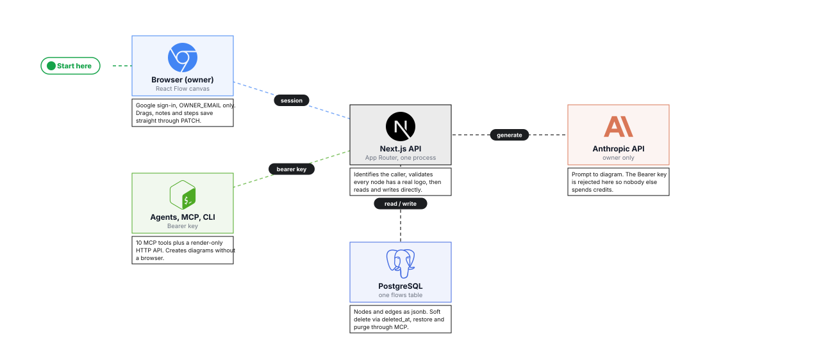

<div align="center">
  
  <h1>Flows</h1>
  <p><em>Interactive AWS/GCP architecture diagrams with a public artifact API and an MCP server</em></p>
  <p><a href="https://flows-bheng.vercel.app">Live</a> &middot; <a href="https://github.com/bunlongheng/flows">Repo</a> &middot; <a href="https://bunlongheng.com/projects/flows">Portfolio</a></p>
</div>
## What it is

Interactive AWS and GCP architecture diagrams on a React Flow canvas, with auto-layout,
per-node notes and numbered steps. A diagram is a row in Postgres, and it comes back out
as SVG, PNG or an **animated GIF** - so an agent can draw one and a README can embed it.

Three ways in: by hand in the browser, a Bearer-gated HTTP API, or any MCP agent.

## Architecture

One Next.js process serves the canvas, the artifact API and the MCP server.

<a href="https://flows-bheng.vercel.app/?id=72a982aa-2fac-4eba-82f7-7d0057ec83ec">
  
</a>

<sub>Diagram made with [Flows](https://flows-bheng.vercel.app) itself.</sub>

## How a diagram is created and rendered

<a href="https://sequences-bheng.vercel.app/s/6b8d7e1e-2028-4941-8f7d-2c75eaa747ea">
  
</a>

<sub>Made with [Sequences](https://sequences-bheng.vercel.app).</sub>

## For agents

Post nodes and edges, get back a URL. Every node must resolve to a real logo or the
create is rejected - that gate is what keeps diagrams readable.

```bash
curl -X POST https://flows-bheng.vercel.app/api/ai/flows \
  -H "Authorization: Bearer $FLOWS_API_SECRET" \
  -H "Content-Type: application/json" \
  -d '{"title":"URL Shortener","is_public":true,
       "nodes":[{"id":"user"},{"id":"apigw"},{"id":"lambda"}],
       "edges":[{"source":"user","target":"apigw"},
                {"source":"apigw","target":"lambda"}]}'
```

Then embed it straight in a README - no auth, no browser:

```markdown

```

| Route | Auth | Returns |
|-------|------|---------|
| `POST /api/ai/flows` | Bearer | Creates a diagram, returns `url` + `share_url` |
| `GET /api/flows/:idOrSlug` | Public | JSON, `?format=svg`, or `?format=gif` (animated) |
| `GET /api/flows/public` | Public | The curated demo roster |
| `GET /api/og?name=<slug>` | Public | 1200x630 share card |

`?format=gif` takes `?frames=` (2-30) and `?w=` (200-1600). The MCP server exposes the
same thing as 10 tools - `create_flow`, `list_flows`, `update_flow` and so on.

**[Full reference -> docs/API.md](docs/API.md)** for every route, flag and environment variable.

## Quick start

```bash
git clone https://github.com/bunlongheng/flows.git
cd flows && npm install
cp .env.example .env          # DATABASE_URL, AUTH_SECRET, OWNER_EMAIL, FLOWS_API_SECRET
npm run migrate && npm run dev
```

Runs on `http://localhost:5174`. `npm test` for unit, `npm run test:e2e` for Playwright.

## Deploy

Vercel, on push to main. The production build runs `db/migrate.mjs` first, and
`lib/env.js` fails the build if a required variable is missing, so a misconfigured
deploy never ships a dead API.

## License

[MIT](LICENSE) (c) Bunlong Heng

---

<div align="center">

<a href="https://bunlongheng.com"></a>
<a href="https://www.linkedin.com/in/bunlongheng/"></a>
<a href="https://www.instagram.com/ibunlong/"></a>
<a href="mailto:bheng.code@gmail.com"></a>

<br>

Built by **[Bunlong](https://bunlongheng.com)** &nbsp;&middot;&nbsp; [more apps](https://bunlongheng.com/projects)

</div>
