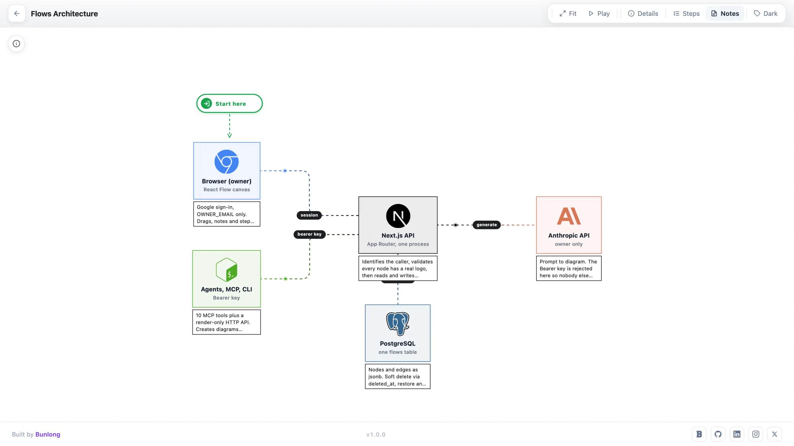
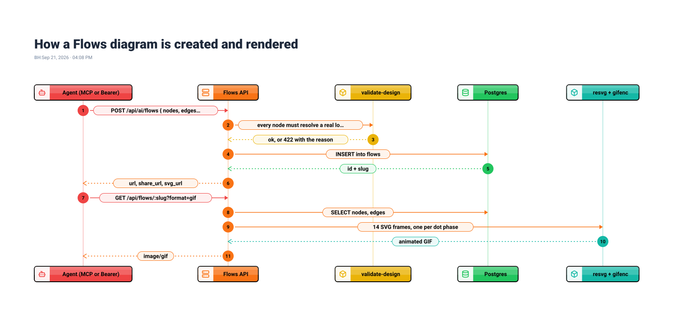

#  Flows

AWS and GCP architecture diagrams an agent can draw and a README can embed.

Describe a system, get a React Flow canvas back: 118 real services with real logos, laid out for you, with per-node notes and numbered steps you can walk a room through. Every diagram is a row in Postgres, and the same row renders back out as JSON, a self-contained SVG or an animated GIF from a plain URL - so the picture in your docs is the diagram, not a screenshot of one that drifted 3 commits ago. An id that resolves to no logo is rejected at create time, which is why a diagram a model made looks like one a person made.



[](https://github.com/bunlongheng/flows/actions/workflows/ci.yml)


**Live:** [flows-bheng.vercel.app](https://flows-bheng.vercel.app) &middot; **Demo wall:** [/demo](https://flows-bheng.vercel.app/demo)

## Features

- **Every node is a real service** - 118 of them, keyed by brand so 2 products of the same vendor never disagree on a logo. An unknown id is rejected, not drawn as a lettered box.
- **Bring your own logo** - pass an `https` URL or a `data:` URI with a label and it is fetched and inlined once, so the diagram stays self-contained forever.
- **It lays itself out** - leave `x`/`y` off and the canvas picks the columns and the spacing, which is the look you actually want back from an agent.
- **The diagram is a URL** - JSON, `?format=svg`, or `?format=gif` for an animated one, all public, no auth and no browser needed.
- **It explains itself** - per-node notes, numbered steps, Play to walk through them, a Details panel and 4 badge styles, each remembered per diagram.
- **3 ways in** - the browser canvas, a Bearer-gated HTTP API, or 10 MCP tools for any agent. Delete is a soft delete, with trash, restore and purge.

## Read this before you clone

This is a working app, not a library. It needs 3 things from you, and 1 more if you want the AI part.

| You provide | Why | Free option |
|---|---|---|
| **Postgres** | Every diagram is a row here, no SQLite fallback | Neon, Supabase, Railway |
| **Google OAuth** | The only sign-in, 1 owner email | Google Cloud Console |
| **A host** | A Next.js server, not a static site | Vercel, or localhost |
| **Anthropic key** | Plain-English generation only | optional |

## 3 ways to get a diagram

**1. An agent makes it.** 10 MCP tools - `create_flow`, `update_flow`, `list_services` and the rest - so a coding agent, a script or a CI job writes straight into your library.

**2. You draw it.** Drag nodes on a React Flow canvas with snap guides, undo, auto layout, per-node notes and numbered steps. Press Play and walk a room through the design 1 step at a time.

**3. curl it into your docs.** 1 Bearer-authed POST returns a URL. Omit the positions and the canvas lays it out left to right for you.

```bash
curl -X POST "$APP/api/ai/flows" \
  -H "Authorization: Bearer $FLOWS_API_SECRET" \
  -H "Content-Type: application/json" \
  -d '{"title":"URL Shortener","is_public":true,
       "nodes":[{"id":"user"},{"id":"apigw"},{"id":"lambda"},{"id":"dynamo"}],
       "edges":[{"source":"user","target":"apigw"},
                {"source":"apigw","target":"lambda"},
                {"source":"lambda","target":"dynamo"}]}'
```

Then the URL is the image - no auth, no browser, animated:

```markdown

```

<a href="https://sequences-bheng.vercel.app/s/6b8d7e1e-2028-4941-8f7d-2c75eaa747ea">
  
</a>

<sub>Made with [Sequences](https://sequences-bheng.vercel.app).</sub>

## Quick start

```bash
git clone https://github.com/bunlongheng/flows.git
cd flows
cp .env.example .env               # DATABASE_URL, AUTH_SECRET, OWNER_EMAIL, FLOWS_API_SECRET
npm install
npm run migrate                    # applies db/migrations to a fresh database
npm run dev                        # http://localhost:5174
```

`npm test` runs 232 unit tests, `npm run test:e2e` runs 27 Playwright tests.

## Configuration

| Env var | Purpose |
|---|---|
| `DATABASE_URL` | Postgres connection string |
| `DATABASE_SSL` | `true` for a remote database |
| `AUTH_SECRET` | Session-cookie secret. `openssl rand -hex 32` |
| `GOOGLE_CLIENT_ID` | Google OAuth client |
| `GOOGLE_CLIENT_SECRET` | Its secret. Callback `/api/auth/callback` |
| `OWNER_EMAIL` | The 1 account allowed to sign in |
| `OWNER_USER_ID` | The id its diagrams are stored under |
| `FLOWS_API_SECRET` | Bearer for the API and MCP. Server-only |
| `ANTHROPIC_API_KEY` | Plain-English generation. Unset disables it |
| `FLOWS_APP_URL` | Absolute links in responses and share pages |

`lib/env.js` fails the build when a required variable is missing, so a misconfigured deploy never ships a dead API.

## API

| Route | Auth | Returns |
|---|---|---|
| `POST /api/ai/flows` | Bearer | A new diagram, with `url` + `share_url` |
| `GET /api/flows/:id` | Public | JSON, `?format=svg` or `?format=gif` |
| `GET /api/flows/public` | Public | The curated demo roster |
| `GET /api/og?name=slug` | Public | 1200x630 share card |

`:id` takes a uuid or a slug. The GIF takes `?frames=` (2-30) and `?w=` (200-1600).

**MCP.** `mcp/server.mjs` exposes 10 tools over stdio. Register it with your agent and point `FLOWS_API_SECRET` at your deployment. Full reference in [docs/API.md](docs/API.md) and [mcp/README.md](mcp/README.md).

## Contributing

Issues and pull requests are welcome. Run `npm run lint`, `npm test` and `npm run test:e2e` before opening one.

## License

[MIT](LICENSE) (c) Bunlong Heng

---

<div align="center">

<a href="https://bunlongheng.com"></a>
<a href="https://www.linkedin.com/in/bunlongheng/"></a>
<a href="https://www.instagram.com/ibunlong/"></a>
<a href="mailto:bheng.code@gmail.com"></a>

<br>

Built by **[Bunlong](https://bunlongheng.com)** &nbsp;&middot;&nbsp; [more apps](https://bunlongheng.com/projects)

</div>
